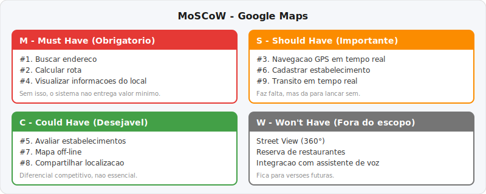
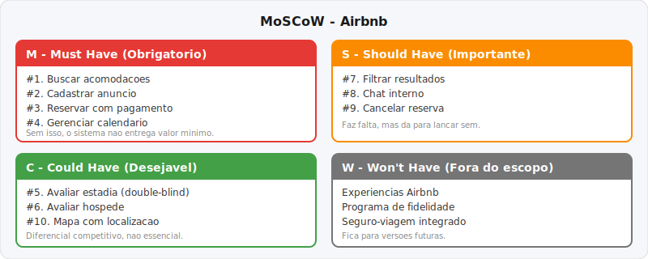
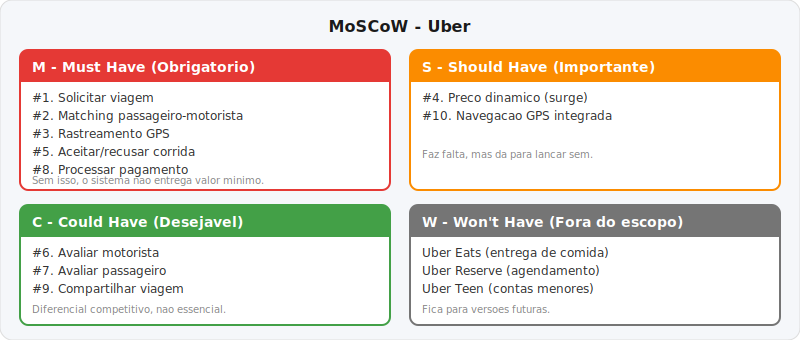
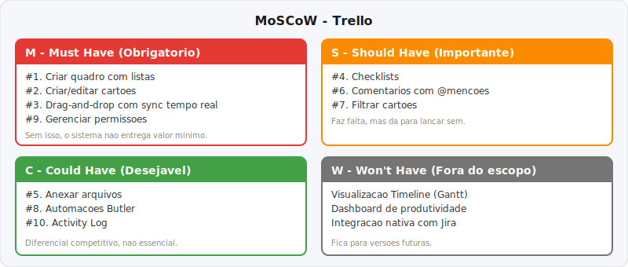

# Analise de Requisitos de Software

Atividade solicitada em sala de aula no curso Tecnico em Desenvolvimento de Sistemas (Senac Minas), disciplina UC 7. O exercicio consiste em analisar requisitos de 4 sistemas reais utilizando tecnicas de engenharia de requisitos.

Alem da analise, foi gerado um **guia de estudos** complementar sobre os conceitos aplicados.

## Sistemas analisados

| # | Sistema | Dominio | Dados reais utilizados |
|---|---------|---------|----------------------|
| 1 | Google Maps | Mapeamento e navegacao | 2B MAU, SLA 99,9%, incidente real fev/2026 |
| 2 | Airbnb | Marketplace de hospedagens | 8M anuncios, PCI-DSS Level 1, framework Orpheus |
| 3 | Uber | Mobilidade sob demanda | 36M viagens/dia, arquitetura DOMA, grid H3 |
| 4 | Trello | Gestao visual Kanban | 50M+ usuarios, Socket.io, last-write-wins |

## O que cada ficha cobre

- **Mapeamento de atores** com dados reais de escala
- **10 funcionalidades principais** verificadas no sistema real
- **Priorizacao MoSCoW** (regra DSDM: Must Have <= 60% do esforco)
- **Requisitos nao funcionais** baseados na ISO 25010
- **Cenario de excecao** com fallbacks e tratamento de erros reais
- **Observacoes tecnicas** com citacao de fontes

## Priorizacao MoSCoW

### Google Maps



### Airbnb



### Uber



### Trello



## Guia de estudos

O arquivo `guia/Guia_de_Estudo_Requisitos.html` contem um guia de estudos sobre os conceitos aplicados nesta atividade, incluindo:

- Requisitos funcionais vs. nao funcionais
- Tecnicas de elicitacao (BABOK)
- Priorizacao MoSCoW e regra DSDM
- Modelo de qualidade ISO 25010
- Padrao IEEE 830
- Links para videos de referencia (PT-BR e EN)

## Estrutura do repositorio

```
├── analise_aprofundada/           # Fichas de analise de requisitos (HTML)
│   ├── Ficha_Requisitos_01_Google_Maps.html
│   ├── Ficha_Requisitos_02_Airbnb.html
│   ├── Ficha_Requisitos_03_Uber.html
│   └── Ficha_Requisitos_04_Trello.html
│
├── guia/                          # Material de estudo
│   ├── Guia_de_Estudo_Requisitos.html
│   └── Guia para Coleta e Analise de Requisitos de Software.pdf
│
├── images/                        # Diagramas MoSCoW
│   ├── moscow_google_maps.svg
│   ├── moscow_airbnb.svg
│   ├── moscow_uber.svg
│   └── moscow_trello.svg
│
└── README.md
```

## Como visualizar

As fichas em HTML podem ser abertas diretamente no navegador.

## Contexto academico

- **Instituicao**: Senac Minas
- **Curso**: Tecnico em Desenvolvimento de Sistemas
- **Disciplina**: UC 7, Aplicacoes em Desenvolvimento Web
- **Aluna**: Thais Oliveira
